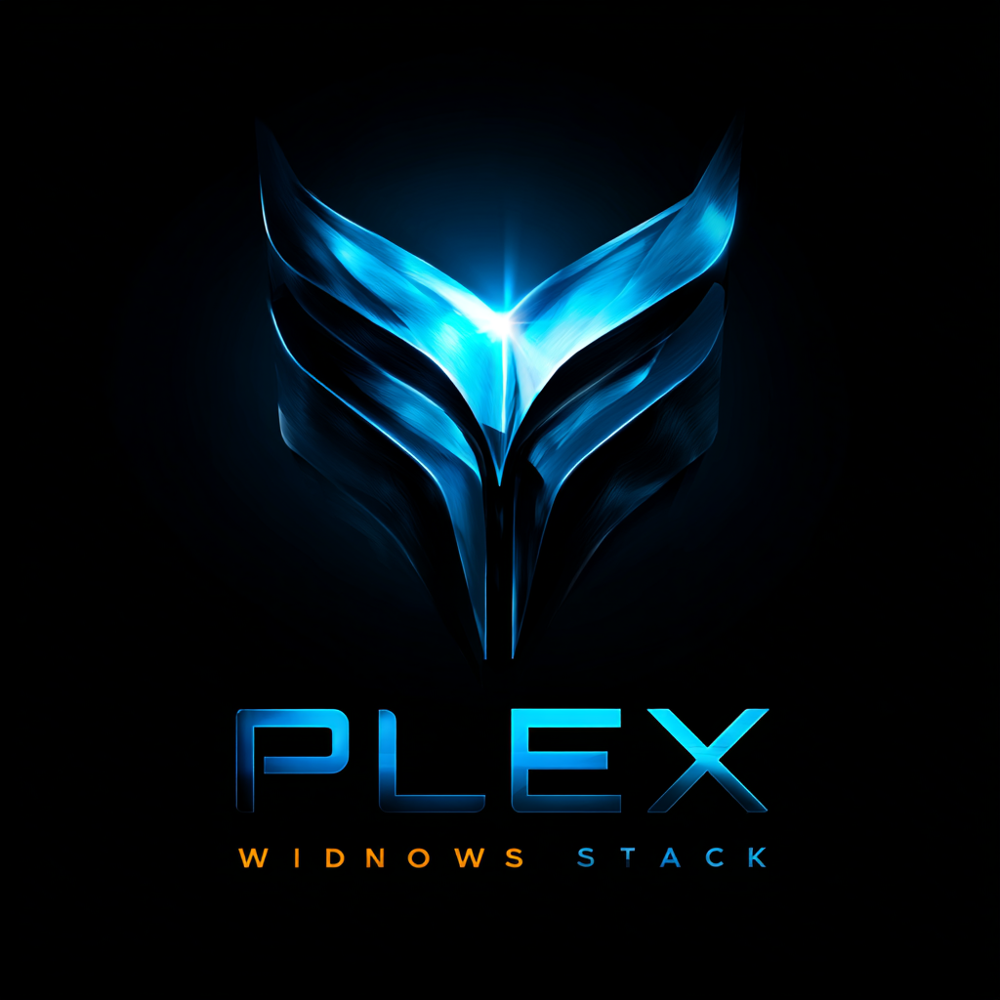

<p align="center">
  
</p>

<h1 align="center">Plex Stack</h1>

<p align="center">
  A complete, beginner-friendly home media server — set up in minutes, runs automatically.
</p>

---

## What Is Plex Stack?

Plex Stack bundles eight services into a single installer. You get Plex for streaming, automatic movie and TV-show downloading, a request portal for family and friends, analytics, and a browser-based control panel — all managed from one dashboard at **http://localhost:7979**.

---

## What You Get

| Service | Port | What It Does |
|---|---|---|
| **Plex** | 32400 | Stream your movies and TV shows on any device, anywhere |
| **Radarr** | 7878 | Automatically finds and downloads movies |
| **Sonarr** | 8989 | Automatically finds and downloads TV shows |
| **Prowlarr** | 9696 | Central indexer manager — feeds Radarr and Sonarr |
| **qBittorrent** | 8080 | Download client |
| **Tautulli** | 8181 | Plex statistics, watch history, and notifications |
| **Seerr** | 5055 | Request portal — lets family and friends ask for titles |
| **Control Panel** | 7979 | Browser dashboard for all of the above |

---

## Requirements

- **Windows 10** (version 1709 or later) or **Windows 11**
- **8 GB RAM** minimum — 16 GB recommended
- An internet connection
- A free [Plex account](https://www.plex.tv/sign-up/)

No prior Docker, Git, or server experience required.

---

## Installation (Windows)

### Step 1 — Download the Installer

**[Download Windows_Install.ps1](https://raw.githubusercontent.com/Bash-Sudo/Plex-Stack/main/Windows_Install.ps1)**

Right-click the downloaded file and choose **Run with PowerShell**, then click **Yes** on the administrator prompt.

If right-click does not show that option, open PowerShell as Administrator and run:

```powershell
Set-ExecutionPolicy Bypass -Scope Process -Force; .\Windows_Install.ps1
```

### Step 2 — What the Installer Does

| Step | What Happens |
|---|---|
| **WSL2** | Enables Windows Subsystem for Linux — may require a one-time restart |
| **Docker Desktop** | Downloads and installs if not already present |
| **Git** | Installs if not already present |
| **Plex Stack** | Downloads and launches the setup wizard in your browser |

If a restart is needed the installer tells you clearly. Restart, run it again, and it picks up where it left off. A **Start Plex Stack** shortcut is created on your Desktop.

### Step 3 — Setup Wizard

The wizard opens at **http://localhost:7979** and walks you through every step:

| Step | What You Do |
|---|---|
| **1 — System** | Timezone and GPU are auto-detected — just confirm |
| **2 — Folders** | Choose where your media lives (auto-filled defaults are fine) |
| **Deploy Phase 1** | All services except Plex start — watch the progress bar |
| **3 — API Keys** | Connect Radarr and Sonarr to qBittorrent |
| **4 — Plex Claim** | Get your claim token right before clicking Deploy |
| **Deploy Phase 2** | Plex starts — redirected to your live dashboard |

> **Plex Claim Token:** Get it from [plex.tv/claim](https://www.plex.tv/claim) right before clicking Deploy — it expires in 4 minutes. This is a one-time setup token, different from your regular Plex Token.

---

## Folder Structure

The installer creates this structure in your Windows Videos folder:

```
Videos/
  media/
    movies/       Radarr moves finished movies here
    tv/           Sonarr moves finished TV shows here
  downloads/
    radarr/       qBittorrent downloads movies here first
    sonarr/       qBittorrent downloads TV shows here first
```

Radarr and Sonarr use hardlinks to move files instantly from downloads to media — no copying, no extra disk space used.

### Docker Paths vs Windows Paths

Inside Docker containers your Videos folder is mounted at `/data`. Whenever any service asks for a file path always use the `/data` format — never the Windows path.

| Purpose | Windows Path | Docker Path — use this |
|---|---|---|
| Movies | `C:\Users\...\Videos\media\movies` | `/data/media/movies` |
| TV Shows | `C:\Users\...\Videos\media\tv` | `/data/media/tv` |
| Movie downloads | `C:\Users\...\Videos\downloads\radarr` | `/data/downloads/radarr` |
| TV downloads | `C:\Users\...\Videos\downloads\sonarr` | `/data/downloads/sonarr` |

---

## Post-Install Service Configuration

After the wizard completes, configure each service in this order.

### 1 — qBittorrent First Login

The image generates a random temporary password on first start. Find it with:

```powershell
docker logs qbittorrent 2>&1 | Select-String "password"
```

Look for a line like:

```
generated temporary admin password: AbCd1234
```

Go to **http://localhost:8080**, log in with username **admin** and that password, then immediately change it under **Tools → Options → Web UI → Authentication**.

**Set the default download path** under **Tools → Options → Downloads**:

- Default save path: `/downloads`

**Add categories** — right-click the sidebar → Add category:

| Category Name | Save Path |
|---|---|
| `radarr` | `/downloads/radarr` |
| `sonarr` | `/downloads/sonarr` |

> These paths map directly to your Windows `Videos\downloads\radarr` and `Videos\downloads\sonarr` folders.

---

### 2 — Prowlarr Indexer Hub

Prowlarr manages all your indexers and automatically shares them with Radarr and Sonarr.

**Settings → Apps → Add Application:**

| App | URL | API Key |
|---|---|---|
| Radarr | `http://radarr:7878` | Radarr → Settings → General |
| Sonarr | `http://sonarr:8989` | Sonarr → Settings → General |

Then add indexers under **Indexers → Add Indexer**. Any indexers you add here automatically appear in Radarr and Sonarr.

> Use Docker service names (`radarr`, `sonarr`, `qbittorrent`) as hostnames — not `localhost`.

---

### 3 — Radarr Movies

**Settings → Media Management → Root Folders → Add:** `/data/media/movies`

> Only add `/data/media/movies` here — do not add the downloads folder as a root folder.

**Settings → Download Clients → Add → qBittorrent:**

| Field | Value |
|---|---|
| Host | `qbittorrent` |
| Port | `8080` |
| Category | `radarr` |
| Username | `admin` |
| Password | your qBittorrent password |

**Settings → Download Clients → Remote Path Mappings → Add:**

| Field | Value |
|---|---|
| Host | `qbittorrent` |
| Remote Path | `/downloads` |
| Local Path | `/data/downloads` |

This tells Radarr how to find completed downloads — qBittorrent stores them at `/downloads/radarr` but Radarr accesses the same folder at `/data/downloads/radarr`.

**Settings → Download Clients → Completed Download Handling:**
- ✅ Enable Completed Download Handling — ON
- ✅ Remove Completed — ON

Once a download finishes, Radarr automatically moves it from `/data/downloads/radarr` to `/data/media/movies` and triggers a Plex library scan.

---

### 4 — Sonarr TV Shows

**Settings → Media Management → Root Folders → Add:** `/data/media/tv`

> Only add `/data/media/tv` here — do not add the downloads folder as a root folder.

**Settings → Download Clients → Add → qBittorrent:**

| Field | Value |
|---|---|
| Host | `qbittorrent` |
| Port | `8080` |
| Category | `sonarr` |
| Username | `admin` |
| Password | your qBittorrent password |

**Settings → Download Clients → Remote Path Mappings → Add:**

| Field | Value |
|---|---|
| Host | `qbittorrent` |
| Remote Path | `/downloads` |
| Local Path | `/data/downloads` |

**Settings → Download Clients → Completed Download Handling:**
- ✅ Enable Completed Download Handling — ON
- ✅ Remove Completed — ON

Once a download finishes, Sonarr automatically moves it from `/data/downloads/sonarr` to `/data/media/tv`.

---

### 5 — Seerr Request Portal

Open **http://localhost:5055** and follow the setup:

1. Sign in with your Plex account
2. Connect to Plex server at `http://plex:32400`
3. Add Radarr at `http://radarr:7878` with its API key
4. Add Sonarr at `http://sonarr:8989` with its API key

---

## NVIDIA GPU Transcoding

The wizard auto-detects NVIDIA GPUs and offers hardware transcoding (NVENC/NVDEC). No extra software needed — Docker Desktop handles GPU access through WSL2.

Requirements:
- Up-to-date NVIDIA drivers (Game Ready or Studio)
- Docker Desktop with WSL2 backend (the default on Windows)

---

## Daily Use

Double-click **Start Plex Stack** on your Desktop. It checks whether Docker is running, starts any stopped containers, and opens http://localhost:7979 in your browser.

---

## Troubleshooting

**Control panel will not load**
Double-click the Start Plex Stack shortcut on your Desktop — it starts Docker and all containers automatically.

**A container shows Stopped on the dashboard**
Click Restart on that service card in the dashboard.

**Setup wizard keeps appearing**
Click the "Already configured? Go to Dashboard" button on the wizard welcome page.

**qBittorrent password unknown**

```powershell
docker logs qbittorrent 2>&1 | Select-String "password"
```

**Services show connection errors to each other**
Use Docker service names as hostnames, not `localhost`:

| Service | Hostname to use |
|---|---|
| qBittorrent | `qbittorrent:8080` |
| Radarr | `radarr:7878` |
| Sonarr | `sonarr:8989` |
| Prowlarr | `prowlarr:9696` |
| Plex | `plex:32400` |

**Full clean restart**

```powershell
cd C:\Users\USERNAME\Plex-Stack
docker compose down --remove-orphans
docker compose up -d
```

**Update to latest version**
Click Update All on the dashboard, or run:

```powershell
cd C:\Users\USERNAME\Plex-Stack
git pull
docker compose up -d --build plex-control
```

---

## Linux and macOS

```bash
git clone https://github.com/Bash-Sudo/Plex-Stack.git
cd Plex-Stack
docker compose up -d --build
```

Open http://localhost:7979 for the control panel.

---

